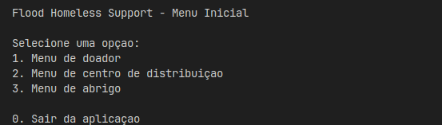

# Sistema de Suporte a Desabrigado em Enchentes

Um aplicação simples (console-based), que simula um ambiente de centros de distribuição, abrigos e doadores para ajudas humanitárias!



## Índice

- <a href="#tecnologias-utilizadas">Tecnologias Utilizadas</a>
- <a href="#funcionalidades-do-projeto">Funcionalidades do Projeto</a>
- <a href="#estrutura-de-arquivos-e-camadas">Estrutura de Arquivos e Camadas</a>
- <a href="#como-executar-a-aplicação">Como Executar a Aplicação</a>

## Tecnologias Utilizadas

Para construir essa aplicação, foram utilizadas as seguintes tecnologias:

| Utilização     | Tecnologia |
| -------------- | ---------- |
| Aplicação      | Java       |
| Gerenciamento  | Maven      |
| ORM            | JDBC       |
| Container      | Docker     |
| Banco de Dados | PostgreSQL |

## Funcionalidades do Projeto

O sistema possui 3 interfaces principais: **Doador**, **Centro de Distribuição** e **Abrigo**.

### Doador

- Um doador é capaz de **doar um item** - com quantidade a seu critério - para um centro de distribuição.
- Um doador também é capaz de **doar itens** para um centro de distribuição a partir de um **arquivo `.csv`** que deve estar localizado dentro da pasta **resources**.

### Centro de Distribuição

- Um centro de distribuição pode visualizar todos os **itens que lhe foram doados**.
- Um centro de distribuição pode visualizar todos os **pedidos pendentes** de um abrigo feitos a ele.
- Um centro de distribuição pode **transferir itens** que possui para outros centros.

### Abrigo

- O usuário consegue **cadastrar** um novo abrigo.
- O usuário consegue **entrar** como um abrigo já existente.
  1. Um abrigo pode **visualizar suas informações e a quantidade de itens** que possui de cada tipo.
  2. Um abrigo pode **solicitar itens** para um centro de distribuição.

## Estrutura de Arquivos e Camadas

O seguinte projeto é subdividido em 4 camadas distintas:

- `UI`: Responsável por mostrar ao usuário a interface e as suas escolhas.
- `Controller`: Disponibiliza recursos para a UI.
- `Service`: Controla as regras da aplicação e as repassa para o Controller.
- `Repository`: Conecta com o banco e busca as informações solicitadas.

## Como Executar a Aplicação

Para executar a aplicação, são necessários alguns passos:

1. Vá até o arquivo `.env-example` na raiz do projeto e altere o seu nome para apenas `.env`;
2. Dentro do arquivo `.env`, altere as propriedades `POSTGRES_USER` e `POSTGRES_PASSWORD` para valores que achar adequados;
3. Vá até o arquivo `db-example.properties` na pasta `resources` e altere o seu nome para apenas `.db.properties`;
4. Dentro do arquivos `db.properties`, altere as propriedades `user` e `password`para os MESMOS VALORES que os adicionados no arquivo `.env`;
5. Abra o seu terminal e rode o seguinte comando para rodar o banco de dados:

```sh
docker compose up --build -d
```

6. Para executar a aplicação de fato, execute o seguinte comando:

```bash
mvn clean package && java -jar ./target/flood-homeless-support-1.0-SNAPSHOT.jar
```
